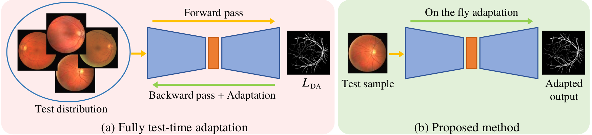

# UNeXt

Official Pytorch Code base for [On-the-Fly Test-time Adaptation for Medical Image Segmentation]()

[Paper]()

## Introduction

One major problem in deep learning-based solutions for medical imaging is the drop in performance when a model is tested on a data distribution different from the one that it is trained on.  Adapting the source model to target data distribution at test-time is an efficient solution for the data-shift problem. Previous methods solve this by adapting the model to target distribution by using techniques like entropy minimization or regularization. In these methods, the models are still updated by back-propagation using an unsupervised loss on complete test data distribution. In real-world clinical settings, it makes more sense to adapt a model to a new test image on-the-fly and avoid model update during inference due to privacy concerns and lack of computing resource at deployment. To this end, we propose a new setting - On-the-Fly Adaptation which is zero-shot and episodic (\emph{i.e.}, the model is adapted to a single image at a time and also does not perform any back-propagation during test-time). To achieve this, we propose a new framework called Adaptive UNet where each convolutional block is equipped with an adaptive batch normalization layer to adapt the features with respect to a domain code. The domain code is generated using a pre-trained encoder trained on a large corpus of medical images. During test-time, the model takes in just the new test image and generates a domain code to adapt the features of source model according to the test data. We validate the performance on both 2D and 3D data distribution shifts where we get a better performance compared to previous test-time adaptation methods.


<p align="center">
  
</p>


## Using the code:

The code is stable while using Python 3.6.13, CUDA >=10.1

- Clone this repository:
```bash
git clone https://github.com/jeya-maria-jose/On-The-Fly-Adaptation
cd On-The-Fly-Adaptation
```

To install all the dependencies using conda:

```bash
conda env create -f environment.yml
conda activate otf
```


## Datasets

1) CHASE - [Link](https://challenge.isic-archive.com/data/)
2) HRF - [Link](https://challenge.isic-archive.com/data/)
3) RITE - [Link](https://challenge.isic-archive.com/data/)
4) BraTS 2019 - [Link](https://www.kaggle.com/aryashah2k/breast-ultrasound-images-dataset)

## Data Format

Make sure to put the files as the following structure (e.g. the number of classes is 2):

```
inputs
└── <dataset name>
    ├── images
    |   ├── 001.png
    │   ├── 002.png
    │   ├── 003.png
    │   ├── ...
    |
    └── masks
        ├── 0
        |   ├── 001.png
        |   ├── 002.png
        |   ├── 003.png
        |   ├── ...
 
```

For binary segmentation problems, just use folder 0.

## Validation

Download the pretrained model weights from [Link](https://drive.google.com/drive/folders/1_8gMlFQHlzpEQyzviET4UzRRDiURWbjk?usp=sharing)

DPG weights: [Link](https://drive.google.com/drive/folders/1CqdLQyBBQQmjrFxub7bzNuLeXHQtMSTo?usp=sharing)

1. Evaluate UNet with no adaptation

```
python val_unet.py --name <source model name> --target <target dataset> 
```
For example, if you want to evaluate the model for CHASE to RITE domain shift, the code will be 

```
python val_unet.py --name chase_unet --target rite 
```

2. Evaluate Adaptive UNet
```
python val_adaptiveunet.py --name <source model name> --target <target dataset> --dpg <folder directory of dpg weights>
```

For example, if you want to evaluate the model for CHASE to RITE domain shift, the code will be 

```
python val_adaptiveunet.py --name chase_adaptiveunet --target rite --dpg "./pretrain_fundus/"
```

## Training Adaptive-UNet


## Volumetric Segmentation Experiments:

For code of volumetric segmentation, click [here]()

### Acknowledgements:

This code-base uses certain code-blocks and helper functions from [UNet++](https://github.com/4uiiurz1/pytorch-nested-unet) and [TENT](https://github.com/DequanWang/tent).

### Citation: